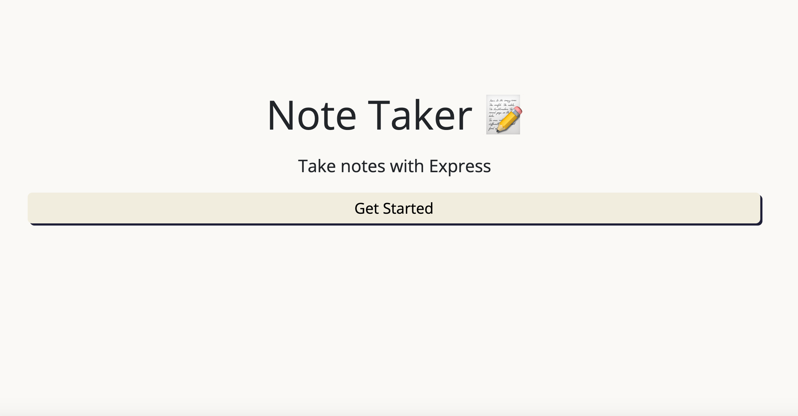
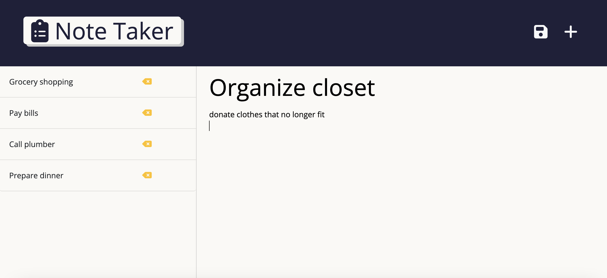

  # Note Taker
  ## Description
   The Note Taker application allows users to add, view, and delete notes. It uses an express backend and stores the note data in a JSON file. The notes consist of a title and text body.
  ## Table of Contents
  - [Description](#description)
  - [Installation](#installation)
  - [Usage](#usage)
  - [Contributing](#contributing)
  - [Questions](#questions)
  
  ## Installation
1. Clone this repository.
```
git clone git@github.com:oliviasylee/note-taker.git
```

2. Run ‘npm install’ from the terminal at the root directory of the local repository to install the required dependencies.
```
npm install
```

3. Once all the packages have been installed, open terminal and run the following code in command line:
```
node server.js
```

4. Go to your localHost:
```
http://localhost:3001
```

  ## Usage
  Live HEROKU application deployed at: [Click here](https://note-taker-oslee.herokuapp.com/) <br>

[]()
<br><br>
[]()
  ## Contributing
  Olivia Seonyeong Lee
  
  ## Questions
  If you have any questions about this projects, please contact me at oliviasylee@Gmail.com. You can view more of my projects at https://github.com/oliviasylee.
